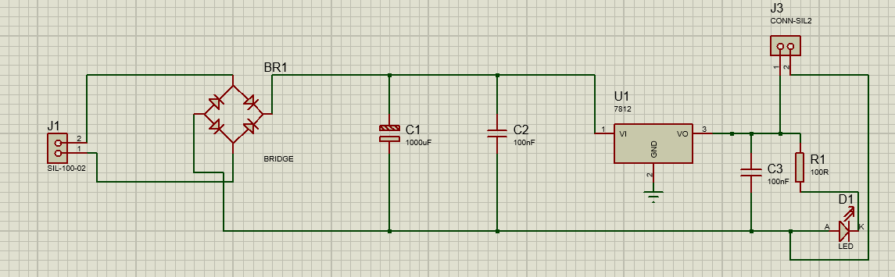
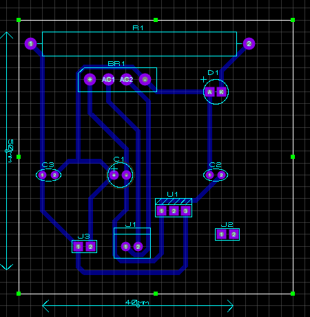
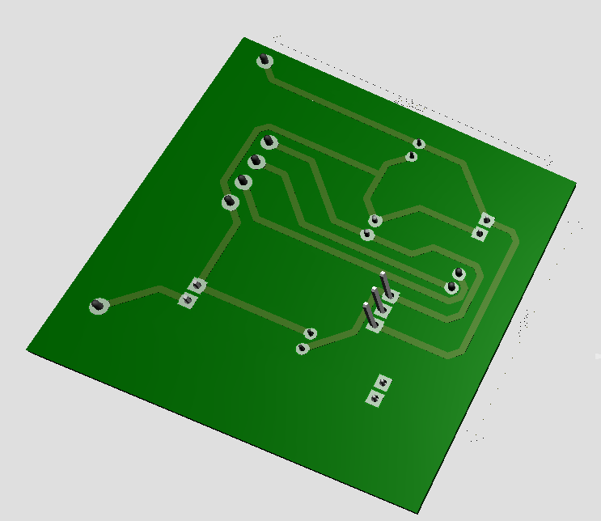
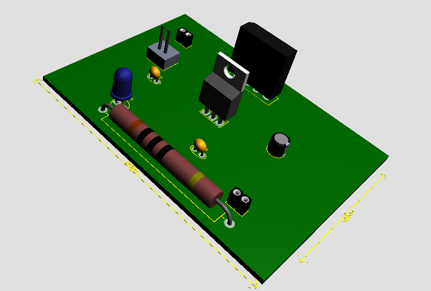

Fonte de Alimentação Regulada de 12V DC

Este projeto consiste em uma fonte de alimentação linear projetada para converter uma tensão de entrada AC (geralmente vinda de um transformador) em uma saída estável de 12V DC

🚀 Características
Tensão de Saída: 12V DC (Estabilizada).

Corrente de Saída: Até 1A (dependendo do dissipador de calor no U1).

Filtragem: Capacitor eletrolítico de alta capacitância para baixo ripple.

Proteção/Indicação: LED indicador de funcionamento na saída.

Dimensões da PCB: 40mm x 50mm

🛠 Componentes Utilizados: 

BR1	         1	Ponte   Retificadora  	BRIDGE
C1	1	Capacitor Eletrolítico	         1000μF
C2, C3	2	Capacitor  Cerâmico/Poliéster	100nF

U1	1	Regulador de Tensão	LM7812
R1	1	Resistor	100Ω
D1	1	LED	Vermelho/Verde
J1	1	Conector de Entrada	SIL-100-02
J2/J3	1	Conector de Saída	Terminal Block

Esquemático e Design

O circuito utiliza uma ponte retificadora, filtragem com capacitor eletrolítico de $1000\mu F$ e o regulador de tensão
  

## ⚡ PCB Layout (80mm x 40mm)
## ⚡ 2. Layout da PCB
O layout foi otimizado para o formato 8x4cm, garantindo trilhas adequadas para a corrente e espaçamento seguro entre os componentes.

  
📦 3. Visualização 3D
Abaixo, a representação tridimensional do projeto finalizado, mostrando a disposição dos componentes e conectores.

O projeto foi dividido em três etapas principais:

Retificação: A ponte de diodos (BR1) converte a corrente alternada (AC) em corrente contínua pulsante.

Filtragem: O capacitor C1 suaviza a onda pulsante, enquanto C2 e C3 eliminam ruídos de alta frequência.

Regulação: O CI 7812 garante que a saída permaneça em 12V constantes, independente de variações na entrada ou na carga.

🔧 Como usar
Conecte a saída de um transformador (sugerido: 15V AC ou 18V AC) ao conector J1.

A tensão regulada de 12V DC estará disponível nos terminais de saída.

Atenção: Se for exigir correntes próximas a 1A, instale um dissipador de calor no regulador U1.
